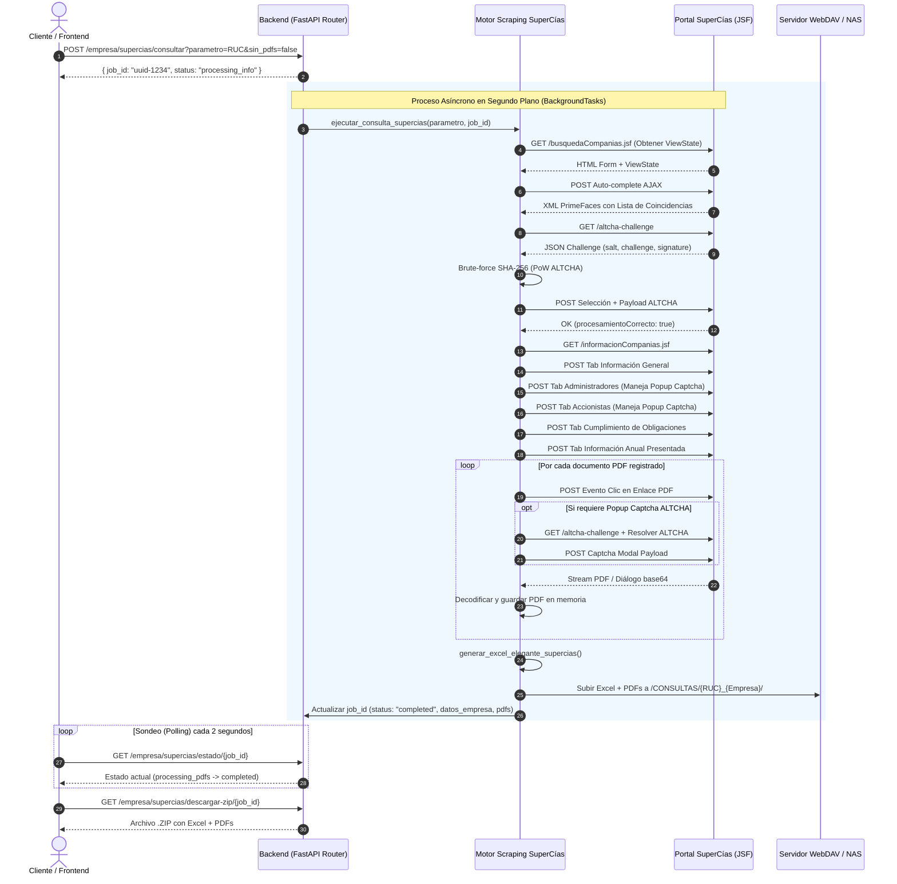

# Guía Completa de Replicación: Consulta SuperCías con Descarga de Documentos (PDFs), Reporte Excel y Respaldo WebDAV

Esta guía documenta en detalle la arquitectura, el protocolo de comunicación **JSF/PrimeFaces**, el motor de resolución automática de desafíos **ALTCHA (Proof of Work)**, la extracción multisección (Información General, Administradores, Accionistas, Cumplimiento y Documentos Anuales PDF), el generador de reportes Excel estilizados con **openpyxl**, el empaquetado en **ZIP** y la sincronización con **WebDAV**.

---

## Tabla de Contenidos
1. [Arquitectura General del Módulo](#arquitectura-general-del-módulo)
2. [Prerrequisitos y Dependencias](#prerrequisitos-y-dependencias)
3. [Protocolo JSF / PrimeFaces y Desafíos de Seguridad](#protocolo-jsf--primefaces-y-desafíos-de-seguridad)
   - [Manejo del ViewState](#1-manejo-del-viewstate)
   - [Resolución del PoW ALTCHA (SHA-256)](#2-resolución-del-pow-altcha-sha-256)
   - [Resolución Fallback de Captcha de Imagen (EasyOCR + OpenCV)](#3-resolución-fallback-de-captcha-de-imagen-easyocr--opencv)
4. [Flujo de Scraping y Extracción de Datos Paso a Paso](#flujo-de-scraping-y-extracción-de-datos-paso-a-paso)
   - [Paso 1: Búsqueda y Autocompletado de Empresas](#paso-1-búsqueda-y-autocompletado-de-empresas)
   - [Paso 2: Selección y Validación de Captcha Inicial](#paso-2-selección-y-validación-de-captcha-inicial)
   - [Paso 3: Navegación e Inspección Pestaña por Pestaña](#paso-3-navegación-e-inspección-pestaña-por-pestaña)
   - [Paso 4: Extracción y Descarga de PDFs de Información Anual](#paso-4-extracción-y-descarga-de-pdfs-de-información-anual)
5. [Generación de Reportes Excel Profesionales (`openpyxl`)](#generación-de-reportes-excel-profesionales-openpyxl)
6. [Integración con Servidor WebDAV / NAS](#integración-con-servidor-webdav--nas)
7. [Script Python Standalone Replicable (`supercias_documentos.py`)](#script-python-standalone-replicable-supercias_documentospy)
8. [Integración en API Backend FastAPI (Tareas en Segundo Plano y Polling)](#integración-en-api-backend-fastapi-tareas-en-segundo-plano-y-polling)
9. [Cliente Frontend (Vue 3 / JavaScript Axios)](#cliente-frontend-vue-3--javascript-axios)
10. [Diagnóstico y Troubleshooting](#diagnóstico-y-troubleshooting)

---

## Arquitectura General del Módulo

El siguiente diagrama visualiza la secuencia completa desde que un cliente solicita una consulta de SuperCías con documentos hasta que se entrega la respuesta y se respaldan los archivos en el servidor WebDAV.



---

## Prerrequisitos y Dependencias

Para replicar este conector en cualquier proyecto de Python (3.10+), instala los siguientes paquetes:

```bash
pip install requests beautifulsoup4 urllib3 openpyxl easyocr opencv-python-headless pillow fastapi uvicorn pydantic
```

### Resumen de Librerías Usadas

| Librería | Propósito |
| :--- | :--- |
| `requests` | Cliente HTTP con gestión de cookies de sesión y montado de reintentos (`HTTPAdapter`). |
| `urllib3` | Configuración de políticas de reintento (`Retry`) para tolerar inestabilidad del portal gubernamental. |
| `beautifulsoup4` | Parsing de respuestas HTML y XML devueltas por el framework JavaServer Faces / PrimeFaces. |
| `openpyxl` | Generación del libro de Excel estilizado con 5 pestañas, colores corporativos y bordes. |
| `easyocr` & `opencv-python-headless` | Motor de OCR secundario para captchas legacy basados en imágenes. |
| `fastapi` | Exposición de endpoints REST asíncronos y ejecución de tareas en segundo plano. |

---

## Protocolo JSF / PrimeFaces y Desafíos de Seguridad

El portal de la Superintendencia de Compañías del Ecuador utiliza **JavaServer Faces (JSF)** con el componente **PrimeFaces**. La comunicación cliente-servidor se basa en solicitudes AJAX que intercambian fragmentos de XML con bloques `<update id="...">`.

### 1. Manejo del ViewState

JSF requiere que en cada petición POST se reenvíe el identificador único `javax.faces.ViewState`. Si el `ViewState` se omite o queda desincronizado, el servidor ignora el comando AJAX o responde con un error de vista expirada (`ViewExpiredException`).

#### Función Regex / BeautifulSoup para Extracción de ViewState:

```python
import re
from bs4 import BeautifulSoup

def extract_viewstate(html_or_xml_text: str) -> str | None:
    """Extrae el token javax.faces.ViewState desde un formulario HTML o una respuesta XML AJAX."""
    if not html_or_xml_text:
        return None
    
    # 1. Buscar en HTML estándar (<input name="javax.faces.ViewState" value="...">)
    soup = BeautifulSoup(html_or_xml_text, 'html.parser')
    viewstate_input = soup.find('input', {'name': 'javax.faces.ViewState'})
    if viewstate_input and viewstate_input.get('value'):
        return viewstate_input.get('value')
    
    # 2. Buscar en XML de respuesta AJAX PrimeFaces (<update id="j_id1:javax.faces.ViewState..."><![CDATA[...]]></update>)
    match = re.search(r'<update id="[^"]*javax\.faces\.ViewState[^"]*"><!\[CDATA\[(.*?)\]\]></update>', html_or_xml_text)
    if match:
        return match.group(1)
        
    return None
```

---

### 2. Resolución del PoW ALTCHA (SHA-256)

SuperCías implementa el mecanismo de protección anti-bot **ALTCHA**, el cual exige resolver un Proof-of-Work (PoW) local basado en la función hash SHA-256.

#### Estructura del Desafío (`/altcha-challenge`):
```json
{
  "algorithm": "SHA-256",
  "challenge": "a1b2c3d4e5f6...",
  "maxnumber": 50000,
  "salt": "f89a2b...",
  "signature": "3c4d5e..."
}
```

#### Solucionador Python de ALTCHA:

```python
import hashlib
import json
import base64
import requests

def resolver_altcha(session: requests.Session, challenge_url: str) -> str | None:
    """
    Obtiene el desafío de ALTCHA y realiza la búsqueda por fuerza bruta (Proof of Work) 
    para encontrar el número que satisface: sha256(salt + str(i)) == challenge.
    Retorna la carga útil codificada en Base64 para el formulario JSF.
    """
    try:
        res = session.get(challenge_url, timeout=10)
        if res.status_code != 200:
            return None
            
        data = res.json()
        salt = data.get("salt")
        challenge = data.get("challenge")
        signature = data.get("signature")
        algorithm = data.get("algorithm", "SHA-256")
        max_number = data.get("maxnumber", 50000)
        
        if not salt or not challenge:
            return None
            
        # Fuerza bruta del número entero i
        for i in range(max_number + 1):
            target_str = f"{salt}{i}".encode('utf-8')
            h = hashlib.sha256(target_str).hexdigest()
                
            if h == challenge:
                payload = {
                    "algorithm": algorithm,
                    "challenge": challenge,
                    "salt": salt,
                    "signature": signature,
                    "number": i
                }
                payload_json = json.dumps(payload)
                payload_b64 = base64.b64encode(payload_json.encode('utf-8')).decode('utf-8')
                return payload_b64
                
        return None
    except Exception as e:
        print(f"[ALTCHA Error] No se pudo resolver el desafío: {e}")
        return None
```

---

### 3. Resolución Fallback de Captcha de Imagen (EasyOCR + OpenCV)

En versiones legacy o popups secundarios de SuperCías se presenta un captcha basado en imágenes numéricas. Se incluye una solución basada en **EasyOCR** y **OpenCV** para el procesamiento de imagen (escalado 3x, umbralización binaria y apertura morfólogica).

```python
import cv2
import numpy as np
import re

_ocr_reader = None

def get_ocr_reader():
    global _ocr_reader
    if _ocr_reader is None:
        import easyocr
        # Carga del modelo numérico en CPU
        _ocr_reader = easyocr.Reader(['en'], gpu=False, verbose=False)
    return _ocr_reader

def resolver_captcha_imagen(imagen_path_or_bytes) -> str | None:
    """Procesa una imagen de captcha numérico y retorna los dígitos detectados."""
    if isinstance(imagen_path_or_bytes, str):
        img = cv2.imread(imagen_path_or_bytes)
    else:
        nparr = np.frombuffer(imagen_path_or_bytes, np.uint8)
        img = cv2.imdecode(nparr, cv2.IMREAD_COLOR)

    if img is None:
        return None

    # Pre-procesamiento de imagen para mejorar la precisión del OCR
    img = cv2.resize(img, None, fx=3, fy=3, interpolation=cv2.INTER_CUBIC)
    gray = cv2.cvtColor(img, cv2.COLOR_BGR2GRAY)
    _, thresh = cv2.threshold(gray, 140, 255, cv2.THRESH_BINARY)
    kernel = np.ones((2, 2), np.uint8)
    thresh = cv2.morphologyEx(thresh, cv2.MORPH_CLOSE, kernel)
    thresh = cv2.morphologyEx(thresh, cv2.MORPH_OPEN, kernel)

    reader = get_ocr_reader()
    resultados = reader.readtext(thresh, allowlist='0123456789', detail=0, paragraph=True)
    texto_completo = ''.join(resultados)
    solo_digitos = re.sub(r'[^0-9]', '', texto_completo)
    return solo_digitos
```

---

## Flujo de Scraping y Extracción de Datos Paso a Paso

### Paso 1: Búsqueda y Autocompletado de Empresas

El autocompletado de PrimeFaces exige una llamada AJAX a `busquedaCompanias.jsf`. Cuando se busca por RUC (13 dígitos), se implementa una **estrategia de búsqueda progresiva por subcadenas** (`[1, 2, 4, 7, 10, 13]` caracteres) para forzar la lista desplegable de sugerencias.

```python
def buscar_empresas(session: requests.Session, url_busqueda: str, viewstate: str, parametro: str):
    ajax_headers = {
        "Faces-Request": "partial/ajax",
        "Accept": "application/xml, text/xml, */*; q=0.01"
    }
    es_ruc = parametro.isdigit() and len(parametro) == 13
    tipo_busqueda = "2" if es_ruc else "3"  # 2: RUC / Expediente | 3: Razón Social
    
    # Evento change de tipo de búsqueda
    payload_tipo = {
        "javax.faces.partial.ajax": "true",
        "javax.faces.source": "frmBusquedaCompanias:tipoBusqueda",
        "javax.faces.partial.execute": "frmBusquedaCompanias:tipoBusqueda",
        "javax.faces.partial.render": "frmBusquedaCompanias:parametroBusqueda frmBusquedaCompanias:panelCompaniaSeleccionada frmBusquedaCompanias:panelCaptcha frmBusquedaCompanias:btnConsultarCompania",
        "javax.faces.behavior.event": "valueChange",
        "javax.faces.partial.event": "change",
        "frmBusquedaCompanias": "frmBusquedaCompanias",
        "frmBusquedaCompanias:tipoBusqueda": tipo_busqueda,
        "frmBusquedaCompanias:parametroBusqueda_input": "",
        "javax.faces.ViewState": viewstate
    }
    res_tipo = session.post(url_busqueda, data=payload_tipo, headers=ajax_headers)
    viewstate = extract_viewstate(res_tipo.text) or viewstate

    empresas = []
    empresa_encontrada = None
    queries = [parametro[:l] for l in [1, 2, 4, 7, 10, 13] if l <= len(parametro)] if es_ruc else [parametro]
        
    for query in queries:
        payload_autocomplete = {
            "javax.faces.partial.ajax": "true",
            "javax.faces.source": "frmBusquedaCompanias:parametroBusqueda",
            "javax.faces.partial.execute": "frmBusquedaCompanias:parametroBusqueda",
            "javax.faces.partial.render": "frmBusquedaCompanias:parametroBusqueda",
            "frmBusquedaCompanias:parametroBusqueda": "frmBusquedaCompanias:parametroBusqueda",
            "frmBusquedaCompanias:parametroBusqueda_query": query,
            "frmBusquedaCompanias": "frmBusquedaCompanias",
            "frmBusquedaCompanias:tipoBusqueda": tipo_busqueda,
            "frmBusquedaCompanias:parametroBusqueda_input": parametro if es_ruc else query,
            "frmBusquedaCompanias:browser": "Edge",
            "frmBusquedaCompanias:altoBrowser": "1080",
            "frmBusquedaCompanias:anchoBrowser": "1920",
            "frmBusquedaCompanias:menuDispositivoMovil": "hidden",
            "javax.faces.ViewState": viewstate
        }
        res_autocomplete = session.post(url_busqueda, data=payload_autocomplete, headers=ajax_headers)
        viewstate = extract_viewstate(res_autocomplete.text) or viewstate
        
        soup_xml = BeautifulSoup(res_autocomplete.text, 'xml')
        update_node = soup_xml.find('update', {'id': 'frmBusquedaCompanias:parametroBusqueda'})
        if update_node and update_node.text:
            soup_html = BeautifulSoup(update_node.text, 'html.parser')
            for item in soup_html.find_all('li', class_='ui-autocomplete-item'):
                valor = item.get('data-item-value', '')
                if valor:
                    empresas.append(valor)
        
        if empresas:
            for emp in empresas:
                if (es_ruc and parametro in emp) or (not es_ruc and parametro.upper() in emp.upper()):
                    empresa_encontrada = emp
                    break
            if empresa_encontrada:
                break

    return empresas, viewstate, empresa_encontrada
```

---

### Paso 2: Selección y Validación de Captcha Inicial

Una vez identificada la cadena exacta de la empresa (por ejemplo `30023 - 0190412040001 - HOMERO ORTEGA PENAFIEL E HIJOS C LTDA`), se ejecuta la selección del elemento (`itemSelect`), se resuelve el reto ALTCHA PoW y se simula el clic en el botón consultar (`btnConsultarCompania`).

```python
# 1. Evento itemSelect
payload_select = {
    "javax.faces.partial.ajax": "true",
    "javax.faces.source": "frmBusquedaCompanias:parametroBusqueda",
    "javax.faces.partial.execute": "frmBusquedaCompanias:parametroBusqueda",
    "javax.faces.partial.render": "frmBusquedaCompanias:parametroBusqueda frmBusquedaCompanias:panelCompaniaSeleccionada frmBusquedaCompanias:panelCaptcha frmBusquedaCompanias:btnConsultarCompania",
    "javax.faces.behavior.event": "itemSelect",
    "javax.faces.partial.event": "itemSelect",
    "frmBusquedaCompanias:parametroBusqueda_itemSelect": empresa_seleccionada,
    "frmBusquedaCompanias:parametroBusqueda_input": empresa_seleccionada,
    "frmBusquedaCompanias": "frmBusquedaCompanias",
    "frmBusquedaCompanias:tipoBusqueda": tipo_busqueda,
    "javax.faces.ViewState": viewstate
}
res_select = session.post(url_busqueda, data=payload_select, headers=ajax_headers)
viewstate = extract_viewstate(res_select.text) or viewstate

# 2. Obtener y resolver ALTCHA PoW
codigo_altcha = resolver_altcha(session, "https://appscvsgen.supercias.gob.ec/consultaCompanias/altcha-challenge")

# 3. Enviar consulta
payload_consultar = {
    "javax.faces.partial.ajax": "true",
    "javax.faces.source": "frmBusquedaCompanias:btnConsultarCompania",
    "javax.faces.partial.execute": "frmBusquedaCompanias:btnConsultarCompania frmBusquedaCompanias:payloadOculto",
    "frmBusquedaCompanias:btnConsultarCompania": "frmBusquedaCompanias:btnConsultarCompania",
    "frmBusquedaCompanias": "frmBusquedaCompanias",
    "frmBusquedaCompanias:tipoBusqueda": tipo_busqueda,
    "frmBusquedaCompanias:parametroBusqueda_input": empresa_seleccionada,
    "frmBusquedaCompanias:payloadOculto": codigo_altcha,
    "javax.faces.ViewState": viewstate
}
res_consultar = session.post(url_busqueda, data=payload_consultar, headers=ajax_headers)
if "procesamientoCorrecto\":true" not in res_consultar.text:
    raise Exception("El servidor no validó el reto ALTCHA o la empresa seleccionada.")
```

---

### Paso 3: Navegación e Inspección Pestaña por Pestaña

Al superar la búsqueda, la sesión queda autorizada. Se realiza un `GET` a `informacionCompanias.jsf` y se activan los menús laterales mediante peticiones POST AJAX:

1. **Información General** (`frmMenu:menuInformacionGeneral`): Extrae RUC, Expediente, Nombre Comercial, Estado Legal, Dirección, Teléfono, CIIU Actividad Principal, Capital.
2. **Administradores Actuales** (`frmMenu:menuAdministradoresActuales`): Si la respuesta incluye `presentarPopupCaptcha: true` en el bloque de argumentos PrimeFaces, se resuelve un nuevo ALTCHA y se envía a `frmCaptcha:btnPresentarContenido`. Extrae Cédula, Nombre, Cargo, Fecha Nombramiento, Período.
3. **Accionistas / Socios** (`frmMenu:menuAccionistas`): Extrae Identificación, Nombre, Nacionalidad, Tipo Inversión, Capital Suscrito y Restricción.
4. **Cumplimiento de Obligaciones** (`frmMenu:menuCumplimientoObligaciones`): Extrae estado societario, control y existencia legal.

---

### Paso 4: Extracción y Descarga de PDFs de Información Anual

Este es el proceso central para obtener los archivos adjuntos (balances, estados de situación, informes de auditoría y notas explicativas).

```python
# 1. Petición para desplegar la pestaña de Información Anual Presentada
payload_anual = {
    "javax.faces.partial.ajax": "true",
    "javax.faces.source": "frmMenu:menuInformacionAnualPresentada",
    "javax.faces.partial.execute": "frmMenu:menuInformacionAnualPresentada",
    "javax.faces.partial.render": "frmInformacionCompanias:panelGroupInformacionCompanias frmCaptcha:panelCaptcha",
    "frmMenu:menuInformacionAnualPresentada": "frmMenu:menuInformacionAnualPresentada",
    "frmMenu": "frmMenu",
    "javax.faces.ViewState": viewstate
}
res_anual = session.post(url_info, data=payload_anual, headers=ajax_headers)
viewstate = extract_viewstate(res_anual.text) or viewstate

# Validar si exige captcha popup antes de mostrar la tabla
soup_anual_xml = BeautifulSoup(res_anual.text, 'xml')
extension_anual = soup_anual_xml.find('extension', {'ln': 'primefaces', 'type': 'args'})
if extension_anual and 'presentarPopupCaptcha' in extension_anual.text:
    codigo_altcha = resolver_altcha(session, challenge_url)
    payload_captcha = {
        "javax.faces.partial.ajax": "true",
        "javax.faces.source": "frmCaptcha:btnPresentarContenido",
        "javax.faces.partial.execute": "frmCaptcha",
        "javax.faces.partial.render": "frmInformacionCompanias:panelGroupInformacionCompanias",
        "frmCaptcha:btnPresentarContenido": "frmCaptcha:btnPresentarContenido",
        "frmCaptcha": "frmCaptcha",
        "altcha": codigo_altcha,
        "frmCaptcha:payloadOcultoPopup": codigo_altcha,
        "javax.faces.ViewState": viewstate
    }
    res_anual = session.post(url_info, data=payload_captcha, headers=ajax_headers)
    viewstate = extract_viewstate(res_anual.text) or viewstate

# 2. Iterar filas de la tabla tblInformacionAnual y solicitar descarga de cada PDF
pdfs_descargados = []
update_node_anual = soup_anual_xml.find('update', {'id': 'frmInformacionCompanias:panelGroupInformacionCompanias'})

if update_node_anual and update_node_anual.text:
    soup_html = BeautifulSoup(update_node_anual.text, 'html.parser')
    div_tabla = soup_html.find('div', id='frmInformacionCompanias:tblInformacionAnual')
    if div_tabla:
        tabla = div_tabla.find('table')
        for tr_idx, tr in enumerate(tabla.find('tbody').find_all('tr')):
            tds = tr.find_all('td')
            if len(tds) >= 2:
                anio = tds[0].get_text(strip=True)
                nombre_doc = tds[1].get_text(strip=True)
                doc_filename = f"{anio}_{nombre_doc}".replace(' ', '_').replace('/', '_')
                doc_filename = re.sub(r'[^a-zA-Z0-9_]', '', doc_filename).lower()[:60] + ".pdf"

                enlace_pdf = tr.find('a', class_='ui-commandlink')
                if enlace_pdf and enlace_pdf.has_attr('id'):
                    id_boton = enlace_pdf['id']
                    
                    # Clic AJAX en el botón del documento
                    payload_pdf = {
                        "javax.faces.partial.ajax": "true",
                        "javax.faces.source": id_boton,
                        "javax.faces.partial.execute": id_boton,
                        "javax.faces.partial.render": "dlgPresentarDocumentoPdf panelPresentarDocumentoPdf dlgPresentarDocumentoPdfConFirmasElectronicas panelPresentarDocumentoPdfConFirmasElectronicas dlgCaptcha frmCaptcha:panelCaptcha",
                        id_boton: id_boton,
                        "javax.faces.ViewState": viewstate
                    }
                    res_pdf = session.post(url_info, data=payload_pdf, headers=ajax_headers)
                    viewstate = extract_viewstate(res_pdf.text) or viewstate

                    # Verificar si la visualización requiere resolver ALTCHA
                    soup_pdf_xml = BeautifulSoup(res_pdf.text, 'xml')
                    ext_pdf = soup_pdf_xml.find('extension', {'ln': 'primefaces', 'type': 'args'})
                    if ext_pdf and 'presentarPopupCaptcha' in ext_pdf.text:
                        c_altcha = resolver_altcha(session, challenge_url)
                        payload_c = {
                            "javax.faces.partial.ajax": "true",
                            "javax.faces.source": "frmCaptcha:btnPresentarContenido",
                            "javax.faces.partial.execute": "frmCaptcha",
                            "javax.faces.partial.render": "dlgPresentarDocumentoPdf panelPresentarDocumentoPdf",
                            "frmCaptcha:btnPresentarContenido": "frmCaptcha:btnPresentarContenido",
                            "frmCaptcha": "frmCaptcha",
                            "altcha": c_altcha,
                            "frmCaptcha:payloadOcultoPopup": c_altcha,
                            "javax.faces.ViewState": viewstate
                        }
                        res_pdf = session.post(url_info, data=payload_c, headers=ajax_headers)

                    # 3. Descargar el binario del PDF desde la URL de descarga directa
                    url_descarga_pdf = "https://appscvsgen.supercias.gob.ec/consultaCompanias/DescargaPdf"
                    res_binary = session.get(url_descarga_pdf, timeout=25)
                    
                    if res_binary.status_code == 200 and len(res_binary.content) > 1000:
                        pdf_b64 = base64.b64encode(res_binary.content).decode('utf-8')
                        pdfs_descargados.append({
                            "name": doc_filename,
                            "content": pdf_b64
                        })
```

---

## Generación de Reportes Excel Profesionales (`openpyxl`)

La función `generar_excel_elegante_supercias` crea un libro `.xlsx` con diseño ejecutivo (paleta corporativa azul `#1F4E78`, tipografía `Segoe UI`, bordes finos, tablas cebra y ajuste automático de columnas).

### Estructura de Hojas del Excel:

1. **Coincidencias de Búsqueda**: Muestra la lista de empresas encontradas por razón social y resalta la empresa elegida.
2. **Información General**: Listado clave-valor estilizado con estado legal, RUC, dirección y cumplimiento.
3. **Administradores**: Tabla consolidada que combina directivos de SuperCías y Representantes Legales del SRI.
4. **Accionistas**: Tabla de composición accionaria (Nacionalidad, Capital Suscrito, Restricciones).
5. **Establecimientos**: Matriz y sucursales según el catastro SRI (distingue abiertos en verde y cerrados en rojo).
6. **Documentos Adjuntos**: Listado de los PDFs descargados, tamaño en KB y estado de guardado WebDAV.

```python
import io
import openpyxl
from openpyxl.styles import Font, PatternFill, Alignment, Border, Side
from openpyxl.utils import get_column_letter

def generar_excel_elegante_supercias(datos_empresa: dict, pdfs: list, empresa_nombre: str, parametro: str, lista_empresas: list = None) -> bytes:
    wb = openpyxl.Workbook()
    font_family = "Segoe UI"

    title_font = Font(name=font_family, size=14, bold=True, color="FFFFFF")
    subtitle_font = Font(name=font_family, size=9, italic=True, color="D9E1F2")
    header_font = Font(name=font_family, size=10, bold=True, color="FFFFFF")
    data_font = Font(name=font_family, size=10, color="333333")
    data_font_bold = Font(name=font_family, size=10, bold=True, color="1B365D")

    fill_title = PatternFill(start_color="1F4E78", end_color="1F4E78", fill_type="solid")
    fill_header = PatternFill(start_color="2F5597", end_color="2F5597", fill_type="solid")
    fill_zebra = PatternFill(start_color="F9FBFD", end_color="F9FBFD", fill_type="solid")

    align_center = Alignment(horizontal="center", vertical="center")
    align_left = Alignment(horizontal="left", vertical="center")

    thin_side = Side(border_style="thin", color="D9D9D9")
    border_cell = Border(left=thin_side, right=thin_side, top=thin_side, bottom=thin_side)

    # HOJA 1: Información General
    ws1 = wb.active
    ws1.title = "Informacion General"
    ws1.merge_cells("A1:G2")
    t_cell = ws1["A1"]
    t_cell.value = f"INFORMACIÓN GENERAL DE LA COMPAÑÍA - {(empresa_nombre or parametro).upper()}"
    t_cell.font = title_font
    t_cell.fill = fill_title
    t_cell.alignment = align_center

    row_idx = 4
    for k, v in (datos_empresa or {}).items():
        if isinstance(v, (str, int, float)):
            ws1.cell(row=row_idx, column=1, value=k).font = data_font_bold
            ws1.cell(row=row_idx, column=2, value=str(v)).font = data_font
            ws1.cell(row=row_idx, column=1).border = border_cell
            ws1.cell(row=row_idx, column=2).border = border_cell
            row_idx += 1

    # Autoajuste de anchos de columna
    for col in ws1.columns:
        max_len = max(len(str(cell.value or '')) for cell in col)
        col_letter = get_column_letter(col[0].column)
        ws1.column_dimensions[col_letter].width = max(max_len + 4, 15)

    buffer = io.BytesIO()
    wb.save(buffer)
    return buffer.getvalue()
```

---

## Integración con Servidor WebDAV / NAS

Para mantener una copia de respaldo centralizada en un almacenamiento NAS o servidor WebDAV, el sistema guarda automáticamente los archivos bajo la ruta `/CONSULTAS/{RUC}_{EMPRESA_LIMPIA}/`.

```python
import re
from app.services.webdav_service import WebDAVService

def guardar_consulta_supercias_en_webdav(datos_empresa: dict, pdfs: list, empresa_nombre: str, parametro: str, lista_empresas: list = None):
    try:
        webdav_service = WebDAVService()

        ruc = (datos_empresa or {}).get("RUC") or (datos_empresa or {}).get("ruc") or ""
        clean_empresa = re.sub(r'[^a-zA-Z0-9 _-]', '_', empresa_nombre or parametro).strip()[:50] or 'EMPRESA'
        clean_ruc = re.sub(r'[^a-zA-Z0-9]', '', str(ruc)) if ruc else ""
        company_folder_name = f"{clean_ruc}_{clean_empresa}" if clean_ruc else clean_empresa

        target_dir = f"{webdav_service.target_folder.rstrip('/')}/CONSULTAS/{company_folder_name}"

        if not webdav_service.exists(target_dir):
            webdav_service.create_directory(target_dir)

        # 1. Subir Excel estilizado
        excel_bytes = generar_excel_elegante_supercias(datos_empresa, pdfs, empresa_nombre, parametro, lista_empresas)
        webdav_service.put_file_contents(f"{target_dir}/reporte_supercias_{clean_empresa}.xlsx", excel_bytes, overwrite=True)

        # 2. Subir todos los documentos PDF descargados
        for pdf in pdfs:
            pdf_name = re.sub(r'[/\\?%*:|"<>]', '_', pdf.get("name", "documento.pdf")).strip()
            pdf_bytes = base64.b64decode(pdf.get("content", ""))
            if pdf_bytes:
                webdav_service.put_file_contents(f"{target_dir}/{pdf_name}", pdf_bytes, overwrite=True)
                
        print(f"[WebDAV OK] Archivos guardados en: {target_dir}")
    except Exception as e:
        print(f"[WebDAV Error] Fallo al respaldar en WebDAV: {e}")
```

---

## Script Python Standalone Replicable (`supercias_documentos.py`)

Para probar la consulta completa y descarga de PDFs de forma independiente en consola:

```python
import requests
import json
import base64
import time
from backend.app.routers.consulta_supercias import ejecutar_consulta_supercias, supercias_jobs

if __name__ == "__main__":
    parametro_test = "0190412040001"  # RUC de prueba
    job_id = "test_job_123"
    
    supercias_jobs[job_id] = {
        "status": "processing_info",
        "datos_empresa": None,
        "pdfs": [],
        "empresa_seleccionada": "",
        "lista_empresas": [],
        "success": False,
        "error": None
    }

    print(f"Iniciando extracción completa con PDFs para RUC: {parametro_test}...")
    ejecutar_consulta_supercias(parametro_test, job_id, sin_pdfs=False)

    resultado = supercias_jobs[job_id]
    if resultado.get("success"):
        print("\n=== CONSULTA EXITOSA ===")
        print("Empresa:", resultado.get("empresa_seleccionada"))
        print("Campos extraídos:", len(resultado.get("datos_empresa", {})))
        print("PDFs descargados:", len(resultado.get("pdfs", [])))
        
        for pdf in resultado.get("pdfs", []):
            print(f" -> {pdf['name']} ({len(pdf['content'])} bytes Base64)")
    else:
        print("\n=== ERROR EN CONSULTA ===")
        print(resultado.get("error"))
```

---

## Integración en API Backend FastAPI (Tareas en Segundo Plano y Polling)

El router de FastAPI expone tres endpoints principales:

```python
from fastapi import APIRouter, BackgroundTasks, HTTPException, Query
from fastapi.responses import StreamingResponse
import uuid
import io
import zipfile

router = APIRouter(prefix="/empresa/supercias", tags=["SuperCías"])

# 1. Iniciar consulta asíncrona
@router.get("/consultar")
@router.post("/consultar")
async def consultar_supercias(background_tasks: BackgroundTasks, parametro: str = Query(...), sin_pdfs: bool = Query(default=False)):
    job_id = str(uuid.uuid4())
    supercias_jobs[job_id] = {
        "status": "processing_info",
        "datos_empresa": None,
        "pdfs": [],
        "empresa_seleccionada": "",
        "lista_empresas": [],
        "success": False,
        "error": None
    }
    background_tasks.add_task(ejecutar_consulta_supercias, parametro, job_id, sin_pdfs)
    return {"job_id": job_id, "status": "processing_info"}

# 2. Consultar estado del trabajo (Polling)
@router.get("/estado/{job_id}")
async def consultar_estado_supercias(job_id: str):
    if job_id not in supercias_jobs:
        raise HTTPException(status_code=404, detail="Trabajo no encontrado o expirado")
    return supercias_jobs[job_id]

# 3. Descargar paquete ZIP completo (Excel + PDFs)
@router.get("/descargar-zip/{job_id}")
async def descargar_zip_supercias(job_id: str):
    if job_id not in supercias_jobs:
        raise HTTPException(status_code=404, detail="Trabajo no encontrado")
        
    resultado = supercias_jobs[job_id]
    datos_empresa = resultado.get("datos_empresa", {})
    pdfs = resultado.get("pdfs", [])
    emp_sel = resultado.get("empresa_seleccionada", "empresa").replace("/", "_").replace(" ", "_")
    lista_empresas = resultado.get("lista_empresas", [])
    
    zip_buffer = io.BytesIO()
    with zipfile.ZipFile(zip_buffer, "w", zipfile.ZIP_DEFLATED) as zipf:
        excel_bytes = generar_excel_elegante_supercias(datos_empresa, pdfs, emp_sel, "", lista_empresas)
        zipf.writestr(f"reporte_{emp_sel}.xlsx", excel_bytes)
        
        for pdf in pdfs:
            pdf_bytes = base64.b64decode(pdf["content"])
            zipf.writestr(pdf["name"], pdf_bytes)
            
    zip_buffer.seek(0)
    return StreamingResponse(
        zip_buffer,
        media_type="application/zip",
        headers={"Content-Disposition": f"attachment; filename=supercias_{emp_sel}.zip"}
    )
```

---

## Cliente Frontend (Vue 3 / JavaScript Axios)

Snippet en Vue 3 para consumir la API, mostrar la barra de progreso y permitir la descarga del ZIP:

```vue
<template>
  <div class="supercias-container">
    <input v-model="ruc" placeholder="Ingrese RUC o Razón Social" class="form-control" />
    <button @click="iniciarConsulta" :disabled="cargando" class="btn btn-primary">
      {{ cargando ? 'Consultando...' : 'Consultar SuperCías con Documentos' }}
    </button>

    <div v-if="cargando" class="progress-bar mt-3">
      <span>Estado: {{ estadoTexto }}</span>
    </div>

    <div v-if="resultado" class="mt-4">
      <h5>{{ resultado.empresa_seleccionada }}</h5>
      <p>PDFs obtenidos: {{ resultado.pdfs.length }}</p>
      
      <button @click="descargarZip" class="btn btn-success">
        <i class="fas fa-file-archive me-2"></i> Descargar ZIP Completo
      </button>

      <ul class="list-group mt-3">
        <li v-for="pdf in resultado.pdfs" :key="pdf.name" class="list-group-item d-flex justify-content-between align-items-center">
          <span>{{ pdf.name }}</span>
          <button @click="verPdf(pdf)" class="btn btn-sm btn-outline-info">Ver Documento</button>
        </li>
      </ul>
    </div>
  </div>
</template>

<script setup>
import { ref } from 'vue'
import axios from 'axios'

const ruc = ref('')
const cargando = ref(false)
const estadoTexto = ref('')
const resultado = ref(null)
let jobId = null

const iniciarConsulta = async () => {
  if (!ruc.value) return
  cargando.value = true
  resultado.value = null
  estadoTexto.value = 'Iniciando consulta en SuperCías...'

  try {
    const res = await axios.get(`/empresa/supercias/consultar?parametro=${ruc.value}&sin_pdfs=false`)
    jobId = res.data.job_id
    hacerSondeo()
  } catch (err) {
    alert('Error al conectar con la API: ' + err.message)
    cargando.value = false
  }
}

const hacerSondeo = () => {
  const interval = setInterval(async () => {
    try {
      const res = await axios.get(`/empresa/supercias/estado/${jobId}`)
      const data = res.data
      
      if (data.status === 'processing_info') {
        estadoTexto.value = 'Extrayendo información general, administradores y accionistas...'
      } else if (data.status === 'processing_pdfs') {
        estadoTexto.value = 'Descargando y decodificando PDFs de estados financieros...'
      } else if (data.status === 'completed' || data.success) {
        clearInterval(interval)
        resultado.value = data
        cargando.value = false
      } else if (data.status === 'error') {
        clearInterval(interval)
        alert('Error: ' + data.error)
        cargando.value = false
      }
    } catch (err) {
      clearInterval(interval)
      cargando.value = false
    }
  }, 2000)
}

const descargarZip = () => {
  window.open(`/empresa/supercias/descargar-zip/${jobId}`, '_blank')
}

const verPdf = (pdf) => {
  const byteCharacters = atob(pdf.content)
  const byteNumbers = new Array(byteCharacters.length)
  for (let i = 0; i < byteCharacters.length; i++) {
    byteNumbers[i] = byteCharacters.charCodeAt(i)
  }
  const byteArray = new Uint8Array(byteNumbers)
  const blob = new Blob([byteArray], { type: 'application/pdf' })
  const blobUrl = URL.createObjectURL(blob)
  window.open(blobUrl, '_blank')
}
</script>
```

---

## Diagnóstico y Troubleshooting

| Problema / Síntoma | Causa Raíz | Solución Sugerida |
| :--- | :--- | :--- |
| **HTTP 500 / 503 / Timeout** | El servidor de la SuperCías está sobrecargado o fuera de servicio. | El código utiliza `HTTPAdapter` con `Retry(total=3, backoff_factor=1)`. Si persiste, reintentar tras 10s. |
| **No se encuentra ViewState** | El token de sesión caducó o el portal retornó un HTML de mantenimiento. | Reiniciar la sesión `requests.Session()` y realizar una nueva petición GET limpia a `busquedaCompanias.jsf`. |
| **ALTCHA Challenge Fails** | El `maxnumber` devuelto por el servidor supera 50,000 iteraciones o la firma venció. | Asegurarse de ejecutar la función `resolver_altcha` inmediatamente antes de enviar el POST (los tokens ALTCHA expiran en < 60s). |
| **PDF descarga 0 bytes o HTML** | El servidor requiere resolver un captcha emergente (Popup Captcha) en la sesión AJAX. | Inspeccionar la etiqueta `<extension ln="primefaces" type="args">` en el XML devuelto y ejecutar `resolver_altcha` para `frmCaptcha:btnPresentarContenido`. |
| **Fallo en guardado WebDAV** | Error de credenciales o la carpeta base `/CONSULTAS` no existe. | Verificar la configuración en `WebDAVService` y asegurarse de que el usuario WebDAV tenga permisos de escritura. |

---
